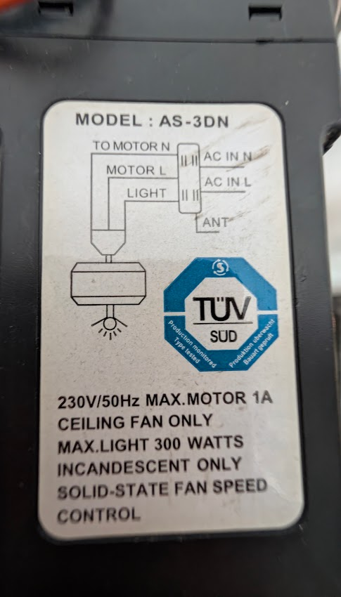
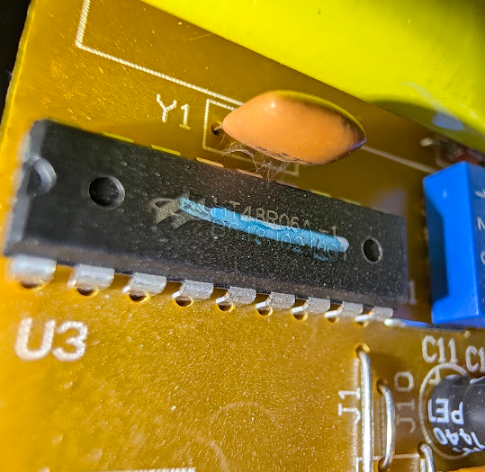

# Hardware notes

## Receiver

- **Label model:** `AS-3DN`
- **Manufacturer:** Air-Supply Technology Co. Ltd (OEM for many fan brands)
- **FCC ID of the US version:** [`SQ8AS-3DN`](https://fccid.io/SQ8AS-3DN), granted 2004 at 303 MHz.
  The FCC filing includes the schematics, internal photos and user manual, and the remote and
  receiver in it look identical to the European unit. The European unit runs at **315 MHz**.
- **Ratings:** 230 V / 50 Hz, motor max 1 A, light max 300 W (incandescent only),
  solid-state fan speed control, TÜV SÜD marked.
- **Wiring:** `AC IN L`, `AC IN N`, `MOTOR L`, `TO MOTOR N`, `LIGHT`, `ANT`.

## Receiver MCU

U3 is a Holtek HT48R06A-1, an 8-bit OTP microcontroller with a ceramic resonator (Y1). It is not a dedicated HT12D decoder. The receiver decodes the HT12-format frames in firmware, which is (I think) why it handles the combination Off code and the light toggle state.

## Retail kit

In Spain, Faro Barcelona sells a remote and receiver kit on its own. The kit listed
as **Faro Barcelona 33929 / 33929C** ("Kit mando a distancia") is probably this same
hardware, but that hasn't been confirmed. If you have one, please check the receiver label.
